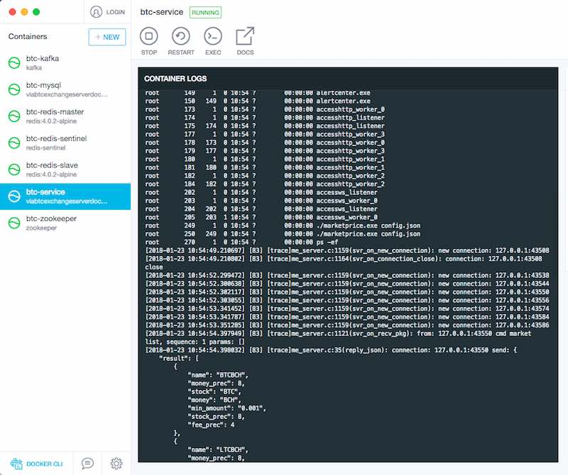

# 使用Docker快速运行viabtc_exchange_server

[English](README.md)


本项目提供了一种简单快速启动[viabtc_exchange_server](https://github.com/viabtc/viabtc_exchange_server) 的Docker配置

这些配置会自动配置以下内容：

* 启动一个Ubuntu容器
* 准备好编译及运行环境
* 从源码构建viabtc_exchange_server
* 搭建并启动依赖服务(如redis kafka mysql等)
* 启动viabtc_exchange_server服务

# 屏幕截图



# 准备工作

* 安装docker包括docker-compose: 详见文档 https://docs.docker.com/compose/install/
* git: 非必须,你也可以下载从页面上下载该仓库
* curl: 非必须，仅测试服务效果使用

# 使用方式

打开终端(linux/mac)或者cmd(windows)

```bash
git clone git@github.com:gyk001/viabtc_exchange_server_docker.git
cd viabtc_exchange_server_docker
docker-compose up
```

等待服务启动完成，然后使用curl命令测试效果

```bash
curl  http://127.0.0.1:18080/ -d '{"method": "market.list", "params": [], "id": 1516681174}'
```

全部搞定了,开始探索吧！


提示: 如果你没有安装git，也可以使用下面的步骤运行

* 手工下载文件 https://codeload.github.com/gyk001/viabtc_exchange_server_docker/zip/master
* 解压下载的压缩包 viabtc_exchange_server_docker-master.zip
* 命令行进入解压后的目录
* 执行`docker-compose up`


# 捐赠

<div id="donate_module">
	<!-- btn_donate & tips -->
	<div id="donate_board">
		<span class="donate_txt">
			If you find this help, please <span class="bold">donate~</span>  Thx.<br/>
			若本项目对您有帮助，<span class="bold">求打赏~</span> 谢谢您的鼓励。
		</span>
	</div>
	<!-- /btn_donate & tips -->
	<!-- donate guide -->
	<div id="donate_guide">
		<div>
			<a href="https://www.paypal.com/cgi-bin/webscr?cmd=_s-xclick&hosted_button_id=G76ZNGLBBYUD6" title="Palpay打赏">
				
			</a>
		</div>
		<a href="http://p30hfwvsg.bkt.clouddn.com/viabtc_exchange_server_docker/alipay.png" target="_blank" title="支付宝扫码打赏">
            
        </a>
        <a href="http://p30hfwvsg.bkt.clouddn.com/viabtc_exchange_server_docker/wepay.png" target="_blank" title="微信扫码打赏">
            
        </a>
	</div>
	<!-- /donate guide -->
	<div>
    	<span class="donate_txt">
            Use App <span class="bold"><a href="http://global.alipay.com/ospay/home.htm">Alipay</a> / <a href="http://www.wechat.com/en/">WeChat</a></span>
            to scan QRCode~ Thx for your support.<br/>
            用手机 <span class="bold"><a href="https://mobile.alipay.com/index.htm">支付宝钱包</a> / <a href="http://weixin.qq.com/">微信</a></span>，
            扫一扫即可~ 谢谢您的鼓励。<br/>
            <br/>
        </span>
	</div>
</div>
<!-- /Donate Module -->


# 链接

* https://github.com/viabtc/viabtc_exchange_server
* https://github.com/docker-library/mysql
* https://github.com/docker-library/redis
* https://github.com/wurstmeister/kafka-docker
* https://github.com/s7anley/redis-sentinel-docker
* https://github.com/vishnubob/wait-for-it

