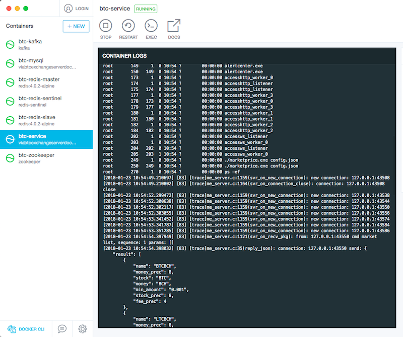

# Easy startup viabtc_exchange_server with docker

[中文](README-zh.md)

This is docker config to startup [viabtc_exchange_server](https://github.com/viabtc/viabtc_exchange_server) simply.

This repo do this things automatic:

* Startup a ubuntu docker container
* Prepare requirements environment
* Build viabtc_exchange_server from sourcecode
* Set up requirement service( redis kafka mysql...)
* Startup viabtc_exchange_server service

# Screenshots



# Prepare

* docker with compose: https://docs.docker.com/compose/install/
* git: not require, you also can download repo from webpage
* curl: not require, just for test

# Startup

Open a terminal(linux/mac) or cmd(windows)

```bash
git clone git@github.com:gyk001/viabtc_exchange_server_docker.git
cd viabtc_exchange_server_docker
docker-compose up
```

Just wait it startup and then test use curl

```bash
curl  http://127.0.0.1:18080/ -d '{"method": "market.list", "params": [], "id": 1516681174}'
```

All is done, just play it!


Tips: if you don't install git, you can startup it like this

* 下载 https://codeload.github.com/gyk001/viabtc_exchange_server_docker/zip/master
* 解压 viabtc_exchange_server_docker-master.zip
* 命令行进入解压后的目录
* 执行`docker-compose up`


``` 


# Donation

<div id="donate_module">
	<!-- btn_donate & tips -->
	<div id="donate_board">
		<span class="donate_txt">
			If you find this help, please <span class="bold">donate~</span>  Thx.<br/>
			若本项目对您有帮助，<span class="bold">求打赏~</span> 谢谢您的鼓励。
		</span>
	</div>
	<!-- /btn_donate & tips -->
	<!-- donate guide -->
	<div id="donate_guide">
		<div>
			<a href="https://www.paypal.com/cgi-bin/webscr?cmd=_s-xclick&hosted_button_id=G76ZNGLBBYUD6" title="Palpay Payment">
				
			</a>
		</div>
		<a href="donate/alipay.png" title="Alipay_Scan_Payment">
			
		</a> &nbsp;
		<a href="donate/wepay.png" title="WeChat_Scan_Payment" class="fancybox" rel="article0">
			
		</a>
	</div>
	<!-- /donate guide -->
	<div>
    	<span class="donate_txt">
            Use App <span class="bold"><a href="http://global.alipay.com/ospay/home.htm">Alipay</a> / <a href="http://www.wechat.com/en/">WeChat</a></span>
            to scan QRCode~ Thx for your support.<br/>
            用手机 <span class="bold"><a href="https://mobile.alipay.com/index.htm">支付宝钱包</a> / <a href="http://weixin.qq.com/">微信</a></span>，
            扫一扫即可~ 谢谢您的鼓励。<br/>
            <br/>
        </span>
	</div>
</div>
<!-- /Donate Module -->

# Links

* https://github.com/viabtc/viabtc_exchange_server
* https://github.com/docker-library/mysql
* https://github.com/docker-library/redis
* https://github.com/wurstmeister/kafka-docker
* https://github.com/s7anley/redis-sentinel-docker
* https://github.com/vishnubob/wait-for-it

